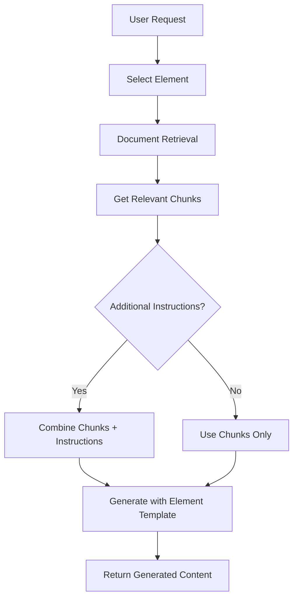

# 🔧 TinyRAG Element-Generation Architecture Redesign

## **Bug Report**

**1. Feature:** Element-Generation Variable System and RAG Integration

**2. The Bug (Actual vs. Expected Behavior):**
- **Actual:** Elements have complex variable systems but no UI to input variables dynamically during generation
- **Expected:** Simple, consistent generation flow with only chunks from retrieval + optional additional instructions

**3. Relevant Components/Files:**
- **Backend:** Element models, Generation models, Template system, RAG flow
- **Frontend:** Element creation, Generation interface
- **Templates:** All tenant element templates with variable dependencies

**4. Code Snippets & Error Logs:**

**Current Element Template with Variables:**
```python
# rag-memo-api/models/element.py
class ElementTemplate(BaseDocument):
    variables: List[str] = Field(
        default_factory=list,
        description="Template variables that can be substituted"
    )
```

**Current Financial Template Example:**
```python
# rag-memo-api/scripts/tenant_data_insertion/tenant_financial_elements.py
"variables": ["company_name", "source_documents"],
"generation_prompt": """You are a financial analyst...
**Company:** {company_name}
**Source Documents (Context):**
---
{source_documents}
---"""
```

**Current Generation with Input Variables:**
```python
# rag-memo-api/models/element_generation.py
class ElementGeneration(BaseDocument):
    input_data: Dict[str, Any] = Field(
        default_factory=dict,
        description="Input data provided for generation"
    )
```

## **Root Cause Analysis**

The current architecture has several fundamental issues:

1. **Complex Variable System**: Elements define variables but there's no UI to input them during generation
2. **Inconsistent Flow**: Some elements expect manual variable input, others expect RAG chunks
3. **Finance Tenant Mismatch**: Financial elements don't need custom variables - they work with retrieval chunks
4. **Risk of Variable Dependency**: Extra variables can be risky and add complexity
5. **Date Issues**: Templates have outdated dates (2025-01-27 vs current 2025-07-01)

## **Proposed New Architecture**

### **🎯 Design Goals**

1. **Simplify**: Remove complex variable systems
2. **Consistency**: All elements work with retrieval chunks + optional instructions
3. **Safety**: Reduce risk from custom variables
4. **User-Friendly**: Simple additional instructions instead of multiple variables

### **🔄 New Generation Flow**



### **📋 New Models**

**Simplified Element Model:**
```python
class ElementTemplate(BaseDocument):
    # Remove variables completely
    # variables: List[str] = Field(...)  # REMOVE THIS
    
    # Add optional additional instructions template
    additional_instructions_template: Optional[str] = Field(
        None,
        description="Optional template for additional user instructions"
    )
    
    # Core prompts remain
    generation_prompt: str = Field(
        description="Main generation prompt - works with chunks and optional instructions"
    )
```

**Simplified Generation Model:**
```python
class ElementGeneration(BaseDocument):
    # Remove input_data/input_variables
    # input_data: Dict[str, Any] = Field(...)  # REMOVE THIS
    
    # Add simple additional instructions
    additional_instructions: Optional[str] = Field(
        None,
        description="Optional additional instructions provided by user"
    )
    
    # Add retrieved chunks
    source_chunks: List[Dict[str, Any]] = Field(
        default_factory=list,
        description="Document chunks used for generation"
    )
```

### **🔧 New Template Structure**

**Before (Complex Variables):**
```python
"generation_prompt": """You are a financial analyst...
**Company:** {company_name}
**Source Documents:**
---
{source_documents}
---
**Analysis Period:** {analysis_period}
**Industry:** {industry}"""

"variables": ["company_name", "source_documents", "analysis_period", "industry"]
```

**After (Simple Chunk-Based):**
```python
"generation_prompt": """You are a financial analyst performing comprehensive analysis.

**Retrieved Document Context:**
{retrieved_chunks}

{additional_instructions}

**Generate a comprehensive financial analysis based solely on the provided document context."""

"additional_instructions_template": "Additional focus areas: [e.g., focus on liquidity, emphasize risk factors, etc.]"
```

### **📊 Migration Strategy**

**Phase 1: Backend Model Updates**
1. Update Element model to remove variables
2. Update Generation model to remove input_data
3. Add additional_instructions fields
4. Update all element templates to new format

**Phase 2: Service Layer Updates**
1. Update ElementService to handle new structure
2. Update GenerationService for chunk-based flow
3. Remove variable substitution logic
4. Add chunk assembly logic

**Phase 3: Frontend Updates**
1. Remove variable input forms
2. Add simple additional instructions field
3. Update element creation to new format
4. Update generation interface

**Phase 4: Template Migration**
1. Convert all existing templates
2. Update dates to 2025-07-01
3. Remove variable dependencies
4. Test all tenant templates

### **🚀 Benefits**

1. **Simplified UX**: Single optional text field instead of multiple variables
2. **Consistent Flow**: All elements work the same way (chunks + instructions)
3. **Reduced Risk**: No complex variable substitution vulnerabilities
4. **Better RAG**: Focus on retrieval quality rather than variable complexity
5. **Maintainable**: Easier to understand, test, and maintain

### **📋 Implementation Plan**

**Step 1: Update Core Models**
- Modify Element and Generation models
- Remove variable-related fields
- Add additional_instructions support

**Step 2: Update Templates**
- Convert all financial templates
- Remove variable dependencies
- Update dates to current (2025-07-01)

**Step 3: Update Services**
- Modify generation flow
- Remove variable substitution
- Add chunk-based processing

**Step 4: Update Frontend**
- Remove variable input UI
- Add additional instructions field
- Update element creation flow

**Step 5: Testing & Migration**
- Test new flow end-to-end
- Migrate existing data
- Deploy with backward compatibility

---

**Next Steps:** Should we proceed with this redesign? I can start with the backend model changes first. 