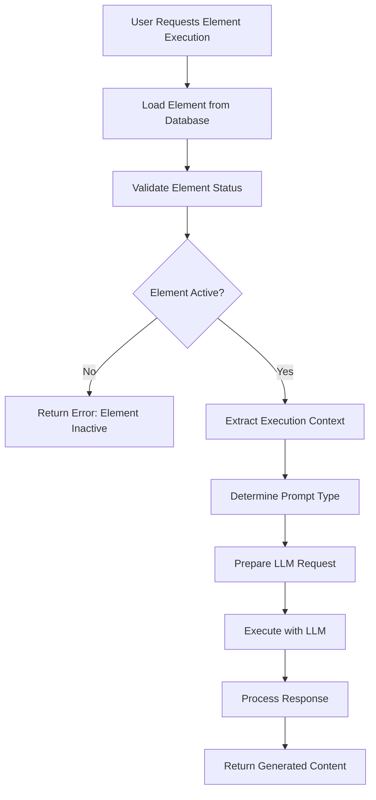
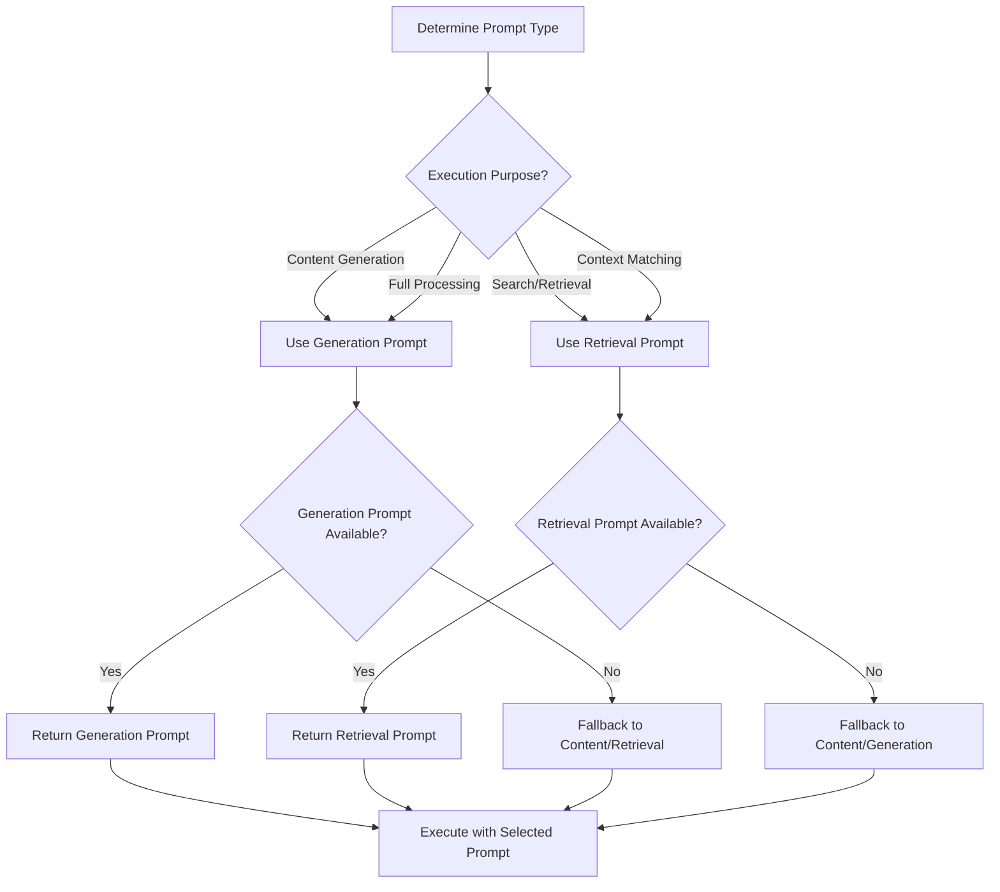
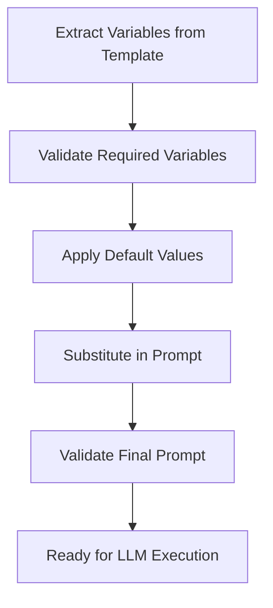

# Element Generation Flow - TinyRAG v1.4.2

## 📋 Overview

This document describes the complete element generation workflow in TinyRAG v1.4.2, focusing on the dual prompt system, LLM integration, and intelligent prompt selection for optimal content generation.

## 🔄 Generation Workflow

### 1. Element Execution Request



### 2. Prompt Type Selection



## 🎯 Dual Prompt System

### Generation Prompt
**Purpose**: Full, detailed prompt for comprehensive content generation
**Characteristics**:
- Complete context and instructions
- Detailed formatting requirements
- Comprehensive examples and guidelines
- Variable substitution support
- Typically 500-2000+ characters

**Use Cases**:
- Content creation and writing
- Complex analysis and reporting
- Structured document generation
- Multi-step reasoning tasks
- Creative content development

### Retrieval Prompt
**Purpose**: Concise, optimized prompt for search and retrieval operations
**Characteristics**:
- Summarized key concepts
- Essential keywords preserved
- Optimized for embedding/vector search
- Typically 100-500 characters
- Generated from generation prompt via LLM

**Use Cases**:
- Document similarity search
- Context retrieval for RAG
- Quick semantic matching
- Index optimization
- Fast content classification

### Prompt Relationship

```
Generation Prompt (Detailed)
         ↓
    LLM Summarization
         ↓
Retrieval Prompt (Concise)
```

## 🤖 LLM Integration

### 1. Prompt Preprocessing

```python
async def preprocess_prompt(element: Element, variables: Dict[str, Any]) -> str:
    """Preprocess prompt with variable substitution and formatting."""
    
    # Select appropriate prompt
    prompt = element.get_effective_prompt(use_generation=True)
    
    # Variable substitution
    for var_name, var_value in variables.items():
        prompt = prompt.replace(f"{{{var_name}}}", str(var_value))
    
    # Format validation
    if not prompt.strip():
        raise ValueError("Empty prompt after preprocessing")
    
    return prompt.strip()
```

### 2. LLM Execution

```python
async def execute_with_llm(
    prompt: str,
    element: Element,
    execution_config: Dict[str, Any]
) -> str:
    """Execute prompt with appropriate LLM configuration."""
    
    # Get LLM configuration
    config = {
        **element.template.execution_config,
        **execution_config
    }
    
    # Initialize LLM provider
    llm = get_llm_provider(
        provider=config.get("provider", "openai"),
        model=config.get("model", "gpt-4o-mini"),
        temperature=config.get("temperature", 0.7),
        max_tokens=config.get("max_tokens", 2000)
    )
    
    # Execute request
    response = await llm.generate(prompt)
    
    return response.content
```

### 3. Response Processing

```python
async def process_llm_response(
    response: str,
    element: Element,
    request_context: Dict[str, Any]
) -> Dict[str, Any]:
    """Process and validate LLM response."""
    
    # Basic validation
    if not response or not response.strip():
        raise ValueError("Empty response from LLM")
    
    # Content processing based on element type
    processed_content = await process_by_element_type(
        content=response,
        element_type=element.element_type,
        task_type=element.task_type
    )
    
    # Return structured response
    return {
        "content": processed_content,
        "element_id": str(element.id),
        "prompt_type": request_context.get("prompt_type", "generation"),
        "execution_time": request_context.get("execution_time"),
        "token_usage": request_context.get("token_usage", {})
    }
```

## 🔧 Variable Substitution

### Variable Processing Pipeline



### Variable Types

```python
class VariableType(Enum):
    TEXT = "text"           # Simple text substitution
    CONTEXT = "context"     # Document/context content
    CONFIG = "config"       # Configuration parameters
    DYNAMIC = "dynamic"     # Runtime-computed values
```

### Variable Substitution Example

```python
# Template with variables
template_prompt = """
You are an expert {role} analyzing {document_type}.

Document Content:
{document_content}

Analysis Framework:
{analysis_framework}

Please provide a comprehensive analysis focusing on {focus_areas}.
"""

# Variable values
variables = {
    "role": "financial analyst",
    "document_type": "quarterly earnings report",
    "document_content": "...",  # Actual document content
    "analysis_framework": "SWOT analysis methodology",
    "focus_areas": "revenue trends and profitability"
}

# Result after substitution
final_prompt = """
You are an expert financial analyst analyzing quarterly earnings report.

Document Content:
[Actual document content...]

Analysis Framework:
SWOT analysis methodology

Please provide a comprehensive analysis focusing on revenue trends and profitability.
"""
```

## 📊 Execution Contexts

### Context Types

#### 1. Content Generation Context
```python
{
    "purpose": "content_generation",
    "prompt_type": "generation",
    "variables": {...},
    "output_format": "structured",
    "quality_requirements": ["accuracy", "completeness"]
}
```

#### 2. Retrieval Context
```python
{
    "purpose": "retrieval",
    "prompt_type": "retrieval", 
    "similarity_threshold": 0.7,
    "max_results": 10,
    "filters": {...}
}
```

#### 3. Analysis Context
```python
{
    "purpose": "analysis",
    "prompt_type": "generation",
    "analysis_type": "comparative",
    "depth": "detailed",
    "include_recommendations": true
}
```

## 🎛️ Configuration Management

### Element-Level Configuration

```python
class ElementContent:
    execution_config: Dict[str, Any] = {
        # LLM Settings
        "provider": "openai",
        "model": "gpt-4o-mini",
        "temperature": 0.7,
        "max_tokens": 2000,
        
        # Processing Settings
        "timeout": 30,
        "retry_attempts": 3,
        "validate_output": True,
        
        # Format Settings
        "output_format": "text",
        "structured_output": False,
        "include_metadata": False
    }
```

### Tenant-Level Defaults

```python
class TenantConfiguration:
    default_llm_config: Dict[str, Any] = {
        "temperature": 0.7,
        "max_tokens": 2000,
        "model": "gpt-4o-mini",
        "provider": "openai"
    }
```

### Configuration Hierarchy

```
System Defaults
      ↓
Tenant Configuration
      ↓
Element Configuration
      ↓
Request Overrides
```

### Step 2: Tenant Configuration Validation

**Process**: Validate element against tenant capabilities
- Verify tenant is active
- All element types supported by all tenants
- Apply tenant-specific defaults

**Key Operations:**
```python
# Get tenant configuration
tenant_config = await TenantConfiguration.get_by_tenant_type(element.tenant_type)

# Validate tenant is active
if not tenant_config.is_active:
    raise ValidationError(f"Tenant {element.tenant_type} is not active")

# Apply tenant defaults
if not element.task_type:
    element.task_type = tenant_config.default_task_type
```

## 🔍 Quality Assurance

### 1. Pre-Execution Validation

```python
async def validate_execution_request(
    element: Element,
    variables: Dict[str, Any],
    context: Dict[str, Any]
) -> List[str]:
    """Validate execution request and return any issues."""
    
    issues = []
    
    # Element validation
    if not element.is_ready_for_execution():
        issues.append("Element not ready for execution")
    
    # Variable validation
    required_vars = set(element.template.variables)
    provided_vars = set(variables.keys())
    missing_vars = required_vars - provided_vars
    
    if missing_vars:
        issues.append(f"Missing required variables: {missing_vars}")
    
    # Prompt validation
    if not element.has_generation_prompt() and not element.has_retrieval_prompt():
        issues.append("No valid prompts available")
    
    return issues
```

### 2. Post-Execution Validation

```python
async def validate_generation_output(
    output: str,
    element: Element,
    context: Dict[str, Any]
) -> Dict[str, Any]:
    """Validate generated output quality."""
    
    validation_result = {
        "is_valid": True,
        "issues": [],
        "quality_score": 0.0,
        "metrics": {}
    }
    
    # Length validation
    if len(output.strip()) < 50:
        validation_result["issues"].append("Output too short")
        validation_result["is_valid"] = False
    
    # Content validation
    if not output.strip():
        validation_result["issues"].append("Empty output")
        validation_result["is_valid"] = False
    
    # Quality metrics
    validation_result["metrics"] = {
        "length": len(output),
        "word_count": len(output.split()),
        "readability_score": calculate_readability(output)
    }
    
    return validation_result
```

## 🚀 Performance Optimizations

### 1. Prompt Caching

```python
from functools import lru_cache

@lru_cache(maxsize=1000)
def get_processed_prompt(
    element_id: str,
    variables_hash: str,
    prompt_type: str
) -> str:
    """Cache processed prompts for reuse."""
    # Implementation details...
```

### 2. Batch Processing

```python
async def execute_batch(
    requests: List[ExecutionRequest],
    batch_size: int = 10
) -> List[ExecutionResult]:
    """Execute multiple elements in batches."""
    
    results = []
    
    for i in range(0, len(requests), batch_size):
        batch = requests[i:i + batch_size]
        batch_results = await asyncio.gather(*[
            execute_element(req) for req in batch
        ])
        results.extend(batch_results)
    
    return results
```

### 3. Streaming Response

```python
async def execute_element_stream(
    element: Element,
    variables: Dict[str, Any]
) -> AsyncGenerator[str, None]:
    """Stream element execution results."""
    
    async for chunk in llm.generate_stream(prompt):
        yield chunk
```

## 📈 Monitoring & Metrics

### Execution Metrics

```python
class ExecutionMetrics:
    element_id: str
    execution_time: float
    token_usage: Dict[str, int]
    prompt_type: str
    success: bool
    error_message: Optional[str]
    quality_score: Optional[float]
```

### Performance Tracking

```python
async def track_execution_performance(
    element: Element,
    execution_time: float,
    success: bool,
    token_usage: Dict[str, int]
):
    """Track element execution performance."""
    
    # Update element-level metrics
    # Log to monitoring system
    # Update tenant-level statistics
    pass
```

## 📝 Summary

The Element Generation Flow in TinyRAG v1.4.2 provides:

✅ **Dual Prompt System**: Optimized prompts for generation vs retrieval
✅ **Intelligent Selection**: Automatic prompt type selection based on context
✅ **Variable Substitution**: Flexible template variable system
✅ **Quality Assurance**: Comprehensive validation at all stages
✅ **Performance Optimization**: Caching, batching, and streaming support
✅ **Monitoring**: Detailed metrics and performance tracking

The system ensures optimal content generation through intelligent prompt management, robust error handling, and comprehensive quality controls. 