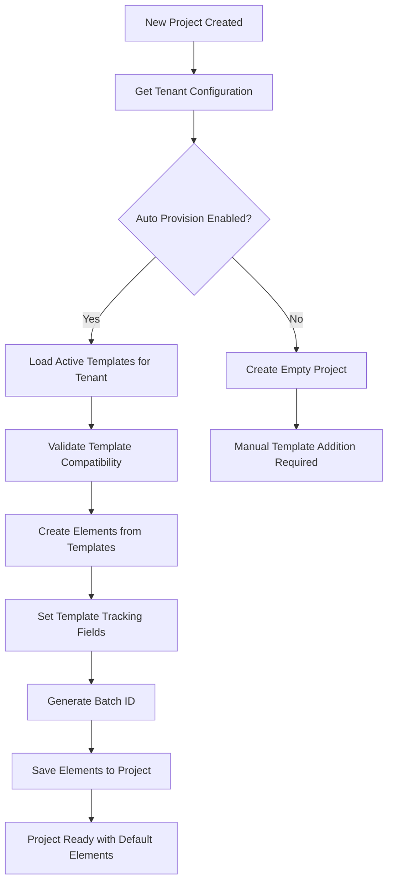
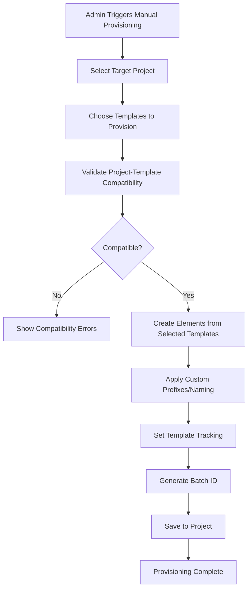

# Tenant-Project Relations - TinyRAG v1.4.2

## 📋 Overview

This document describes the relationship structure between tenants, projects, and elements in TinyRAG v1.4.2, including provisioning patterns, inheritance hierarchies, and operational workflows for the **simplified, essential-only architecture**.

## 🏗️ Relationship Architecture

### Core Entity Hierarchy

```
TenantConfiguration
       │
       ├── ElementTemplate (N)
       │   ├── tenant_type: inherited
       │   ├── auto_provision: bool
       │   └── dual_prompt_system
       │
       └── Project (N)
           ├── tenant_type: inherited
           ├── elements: Element[] (N)
           └── auto_provisioned: bool
               │
               └── Element (N)
                   ├── template_id: reference
                   ├── is_default_element: bool
                   └── insertion_batch_id: tracking
```

### Relationship Constraints

```python
# 1:N Relationships
TenantConfiguration (1) ←→ (N) ElementTemplate
TenantConfiguration (1) ←→ (N) Project  
Project (1) ←→ (N) Element

# Template Tracking
ElementTemplate (1) ←→ (N) Element (via template_id)

# Inheritance Rules
Project.tenant_type ← TenantConfiguration.tenant_type
Element.tenant_type ← Project.tenant_type
Element.task_type ← ElementTemplate.task_type (default)
```

## 🎯 Tenant Configuration Patterns

### 1. HR Tenant Configuration

```python
hr_config = TenantConfiguration(
    tenant_type=TenantType.HR,
    display_name="Human Resources",
    description="HR policy analysis and employee management tools",
    
    # Default Settings
    default_task_type=TaskType.RAG_QA,
    default_llm_config={
        "temperature": 0.3,     # Lower for consistency
        "max_tokens": 2000,
        "model": "gpt-4o-mini"
    },
    
    # Capabilities
    auto_provision_templates=True,
    allowed_element_types=[
        ElementType.PROMPT_TEMPLATE,
        ElementType.MCP_CONFIG
    ],
    
    is_active=True,
    created_by="system"
)
```

### 2. Coding Tenant Configuration

```python
coding_config = TenantConfiguration(
    tenant_type=TenantType.CODING,
    display_name="Software Development", 
    description="Code analysis, review, and documentation tools",
    
    # Default Settings
    default_task_type=TaskType.STRUCTURED_GENERATION,
    default_llm_config={
        "temperature": 0.2,     # Lower for code accuracy
        "max_tokens": 3000,     # Higher for complex code
        "model": "gpt-4o-mini"
    },
    
    # Capabilities
    auto_provision_templates=True,
    allowed_element_types=[
        ElementType.PROMPT_TEMPLATE,
        ElementType.AGENTIC_TOOL
    ],
    
    is_active=True,
    created_by="system"
)
```

### 3. Financial Tenant Configuration

```python
financial_config = TenantConfiguration(
    tenant_type=TenantType.FINANCIAL_REPORT,
    display_name="Financial Analysis",
    description="Financial statement analysis and reporting tools",
    
    # Default Settings
    default_task_type=TaskType.RAG_QA,
    default_llm_config={
        "temperature": 0.4,     # Balanced for analysis
        "max_tokens": 2500,
        "model": "gpt-4o-mini"
    },
    
    # Capabilities
    auto_provision_templates=True,
    allowed_element_types=[
        ElementType.PROMPT_TEMPLATE,
        ElementType.RAG_CONFIG
    ],
    
    is_active=True,
    created_by="system"
)
```

## 🚀 Project Provisioning Workflows

### 1. Automatic Provisioning (Default)



### 2. Manual Provisioning



## 🔄 Element Lifecycle Management

### Template-Based Element Creation

```python
async def create_element_from_template(
    project_id: str,
    template: ElementTemplate,
    batch_id: str,
    customizations: Optional[Dict[str, Any]] = None
) -> Element:
    """Create element from template with proper tracking."""
    
    # Create element content from template
    element_content = ElementContent(
        content=template.generation_prompt,  # Legacy compatibility
        generation_prompt=template.generation_prompt,
        retrieval_prompt=template.retrieval_prompt,
        variables=template.variables.copy(),
        execution_config=template.execution_config.copy(),
        version=template.version
    )
    
    # Apply customizations if provided
    if customizations:
        element_content.execution_config.update(
            customizations.get("execution_config", {})
        )
    
    # Create element with tracking
    element = Element(
        name=customizations.get("name", template.name),
        description=template.description,
        project_id=project_id,
        tenant_type=template.tenant_type,
        task_type=template.task_type,
        element_type=template.element_type,
        template=element_content,
        
        # Template tracking (Essential for v1.4.2)
        is_default_element=True,
        template_id=str(template.id),
        insertion_batch_id=batch_id,
        
        tags=template.tags.copy(),
        owner_id=customizations.get("owner_id", "system"),
        status=ElementStatus.ACTIVE
    )
    
    await element.save()
    return element
```

## 🔍 Query Patterns

### Project-Centric Queries

```python
# Get all elements for a project
async def get_project_elements(project_id: str) -> List[Element]:
    return await Element.find({"project_id": project_id}).to_list()

# Get default elements only
async def get_default_elements(project_id: str) -> List[Element]:
    return await Element.find({
        "project_id": project_id,
        "is_default_element": True
    }).to_list()

# Get user-created elements only
async def get_user_elements(project_id: str) -> List[Element]:
    return await Element.find({
        "project_id": project_id,
        "is_default_element": False
    }).to_list()

# Get elements by template
async def get_elements_from_template(
    project_id: str, 
    template_id: str
) -> List[Element]:
    return await Element.find({
        "project_id": project_id,
        "template_id": template_id
    }).to_list()
```

### Tenant-Centric Queries

```python
# Get all projects for tenant
async def get_tenant_projects(tenant_type: TenantType) -> List[Project]:
    return await Project.find({"tenant_type": tenant_type}).to_list()

# Get tenant statistics
async def get_tenant_statistics(tenant_type: TenantType) -> Dict[str, Any]:
    projects = await Project.find({"tenant_type": tenant_type}).to_list()
    project_ids = [str(p.id) for p in projects]
    
    elements = await Element.find({
        "project_id": {"$in": project_ids}
    }).to_list()
    
    return {
        "tenant_type": tenant_type.value,
        "total_projects": len(projects),
        "total_elements": len(elements),
        "default_elements": len([e for e in elements if e.is_default_element]),
        "user_elements": len([e for e in elements if not e.is_default_element]),
        "templates_used": len(set(e.template_id for e in elements if e.template_id))
    }
```

## 🛠️ Batch Operations

### Batch Provisioning

```python
async def batch_provision_projects(
    project_ids: List[str],
    template_ids: Optional[List[str]] = None
) -> Dict[str, Any]:
    """Provision templates to multiple projects in batch."""
    
    batch_id = f"batch_provision_{datetime.utcnow().strftime('%Y%m%d_%H%M%S')}"
    results = {
        "batch_id": batch_id,
        "total_projects": len(project_ids),
        "successful_provisions": [],
        "failed_provisions": [],
        "total_elements_created": 0
    }
    
    for project_id in project_ids:
        try:
            project = await Project.get(project_id)
            if not project:
                results["failed_provisions"].append({
                    "project_id": project_id,
                    "error": "Project not found"
                })
                continue
            
            # Get templates to provision
            if template_ids:
                templates = []
                for tid in template_ids:
                    template = await ElementTemplate.get(tid)
                    if template and template.tenant_type == project.tenant_type:
                        templates.append(template)
            else:
                templates = await ElementTemplate.find({
                    "tenant_type": project.tenant_type,
                    "status": ElementStatus.ACTIVE
                }).to_list()
            
            # Create elements
            created_elements = []
            for template in templates:
                element = await create_element_from_template(
                    project_id=project_id,
                    template=template,
                    batch_id=batch_id
                )
                created_elements.append(element)
            
            results["successful_provisions"].append({
                "project_id": project_id,
                "elements_created": len(created_elements),
                "template_count": len(templates)
            })
            results["total_elements_created"] += len(created_elements)
            
        except Exception as e:
            results["failed_provisions"].append({
                "project_id": project_id,
                "error": str(e)
            })
    
    return results
```

### Batch Cleanup

```python
async def batch_cleanup_elements(
    batch_id: str,
    dry_run: bool = True
) -> Dict[str, Any]:
    """Clean up elements created in a specific batch."""
    
    # Find elements in batch
    elements = await Element.find({
        "insertion_batch_id": batch_id,
        "is_default_element": True
    }).to_list()
    
    cleanup_results = {
        "batch_id": batch_id,
        "total_elements": len(elements),
        "dry_run": dry_run,
        "elements_to_remove": [],
        "removal_summary": {}
    }
    
    # Group by project for summary
    project_groups = {}
    for element in elements:
        if element.project_id not in project_groups:
            project_groups[element.project_id] = []
        project_groups[element.project_id].append(element)
    
    cleanup_results["removal_summary"] = {
        pid: len(elements) for pid, elements in project_groups.items()
    }
    
    if not dry_run:
        # Actually remove elements
        for element in elements:
            await element.delete()
            cleanup_results["elements_to_remove"].append(str(element.id))
    else:
        # Just list what would be removed
        cleanup_results["elements_to_remove"] = [
            str(e.id) for e in elements
        ]
    
    return cleanup_results
```

## 📊 Relationship Validation

### Project-Tenant Validation

```python
async def validate_project_tenant_consistency(project_id: str) -> Dict[str, Any]:
    """Validate consistency between project and its elements."""
    
    project = await Project.get(project_id)
    if not project:
        return {"error": "Project not found"}
    
    elements = await Element.find({"project_id": project_id}).to_list()
    
    validation_results = {
        "project_id": project_id,
        "project_tenant": project.tenant_type.value,
        "total_elements": len(elements),
        "inconsistencies": [],
        "is_valid": True
    }
    
    for element in elements:
        # Check tenant type consistency
        if element.tenant_type != project.tenant_type:
            validation_results["inconsistencies"].append({
                "element_id": str(element.id),
                "element_name": element.name,
                "issue": "tenant_type_mismatch",
                "element_tenant": element.tenant_type.value,
                "project_tenant": project.tenant_type.value
            })
        
        # Check template consistency (if applicable)
        if element.template_id:
            template = await ElementTemplate.get(element.template_id)
            if template and template.tenant_type != element.tenant_type:
                validation_results["inconsistencies"].append({
                    "element_id": str(element.id),
                    "element_name": element.name,
                    "issue": "template_tenant_mismatch",
                    "template_tenant": template.tenant_type.value,
                    "element_tenant": element.tenant_type.value
                })
    
    validation_results["is_valid"] = len(validation_results["inconsistencies"]) == 0
    return validation_results
```

## 📈 Performance Considerations

### Indexing Strategy

```python
# Project-based queries (most common)
Element: [("project_id", 1)]
Element: [("project_id", 1), ("is_default_element", 1)]
Element: [("project_id", 1), ("template_id", 1)]

# Tenant-based queries
Project: [("tenant_type", 1)]
ElementTemplate: [("tenant_type", 1), ("status", 1)]

# Batch operations
Element: [("insertion_batch_id", 1)]
Element: [("template_id", 1)]

# Combined queries
Element: [("project_id", 1), ("tenant_type", 1)]
```

### Caching Patterns

```python
from functools import lru_cache

# Cache tenant configurations (rarely change)
@lru_cache(maxsize=10)
async def get_tenant_config(tenant_type: TenantType) -> TenantConfiguration:
    return await TenantConfiguration.get_by_tenant_type(tenant_type)

# Cache active templates per tenant
@lru_cache(maxsize=50)
async def get_active_templates(tenant_type: TenantType) -> List[ElementTemplate]:
    return await ElementTemplate.find({
        "tenant_type": tenant_type,
        "status": ElementStatus.ACTIVE
    }).to_list()
```

## 🔧 Configuration Inheritance

### Configuration Flow

```
System Defaults
      ↓
TenantConfiguration.default_llm_config
      ↓
ElementTemplate.execution_config
      ↓
Element.template.execution_config
      ↓
Runtime Overrides
```

### Example Configuration Inheritance

```python
# System defaults
SYSTEM_DEFAULTS = {
    "temperature": 0.7,
    "max_tokens": 2000,
    "model": "gpt-4o-mini"
}

# HR Tenant configuration
hr_config.default_llm_config = {
    "temperature": 0.3,  # Override for consistency
    "max_tokens": 2000,  # Use system default
    "model": "gpt-4o-mini"  # Use system default
}

# HR Template configuration
hr_template.execution_config = {
    "temperature": 0.2,  # Override tenant default for this template
    "max_tokens": 1500,  # Lower for policy analysis
    "timeout": 30
}

# Final configuration for element execution
final_config = {
    **SYSTEM_DEFAULTS,
    **hr_config.default_llm_config,
    **hr_template.execution_config,
    **runtime_overrides  # If any
}
```

## 📝 Summary

The Tenant-Project Relations in TinyRAG v1.4.2 provide:

✅ **Clear Hierarchy**: Well-defined tenant → project → element relationships
✅ **Flexible Provisioning**: Automatic, manual, and selective provisioning patterns
✅ **Template Tracking**: Complete traceability from templates to elements
✅ **Batch Operations**: Efficient bulk provisioning and cleanup
✅ **Validation**: Comprehensive consistency checking
✅ **Performance**: Optimized queries and caching strategies
✅ **Configuration Inheritance**: Hierarchical configuration with overrides
✅ **Simplified Design**: Essential-only attributes without over-engineering

This architecture ensures scalable, maintainable, and performant multi-tenant element management with clear operational patterns for all stakeholders in the **v1.4.2 simplified architecture**.

---

**Ready for v1.4.3**: Foundation established for advanced features and enhanced analytics. 