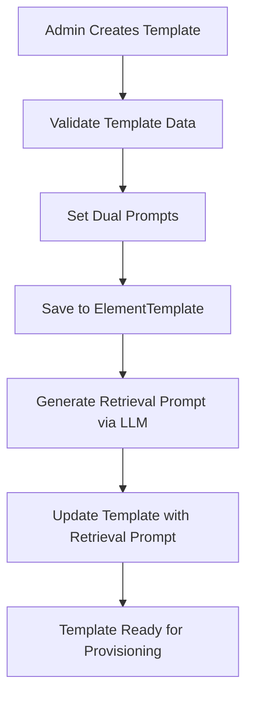
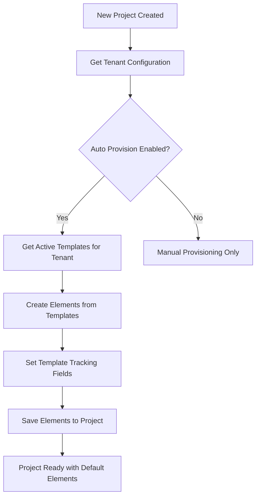
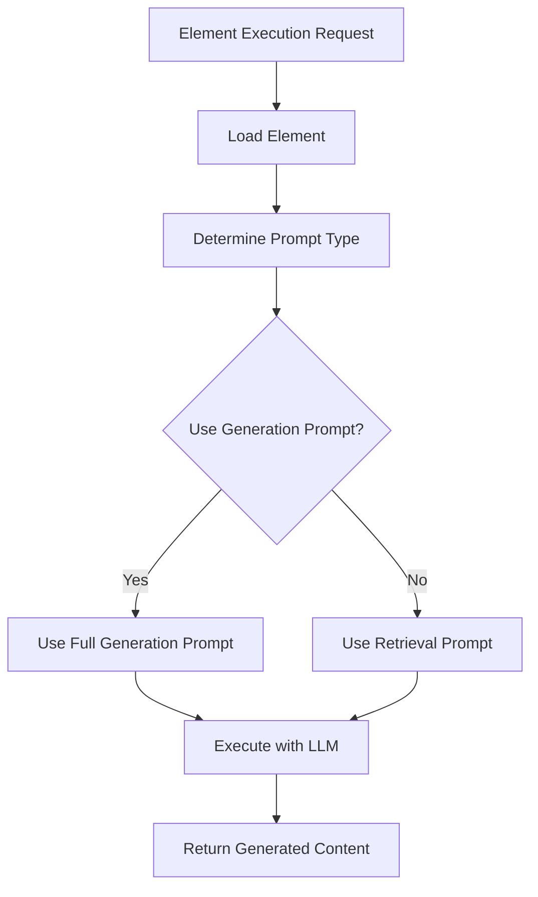
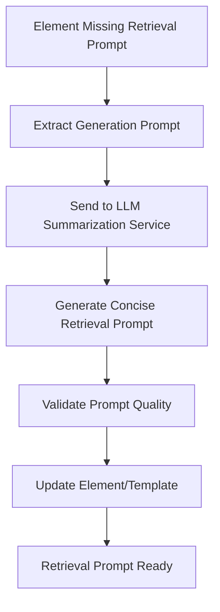

# TinyRAG v1.4.2 - Final Element Management Architecture

## 📋 Overview

TinyRAG v1.4.2 implements a **simplified, essential-only** Element Management System with dual prompt architecture, automatic template provisioning, and intelligent element generation. This document describes the complete system architecture, relationships, and workflows.

## 🎯 Design Philosophy

### Core Principles
- **Essential Only**: No over-engineered analytics or complex tracking
- **Clear Relationships**: Simple tenant → project → element hierarchy  
- **Dual Prompt Focus**: Generation vs retrieval prompt optimization
- **Safe Operations**: Batch tracking for all script operations
- **Legacy Compatible**: Preserves existing functionality

### Architectural Goals
1. **Simplicity**: Minimal, focused models with clear responsibilities
2. **Extensibility**: Easy to add new tenant types and element types
3. **Performance**: Optimized database schema and efficient queries
4. **Safety**: Comprehensive tracking and rollback capabilities
5. **Maintainability**: Clean code with clear patterns

## 🗃️ Database Schema

### Core Models

#### 1. ElementTemplate
**Purpose**: Stores reusable element templates for automatic provisioning

```python
class ElementTemplate(BaseDocument):
    # Identity
    name: str                    # Template name (unique per tenant)
    description: str             # Template description
    
    # Classification
    tenant_type: TenantType      # Associated tenant type
    task_type: TaskType          # Task processing approach
    element_type: ElementType    # Type of element
    
    # Dual Prompt System
    generation_prompt: str       # Full detailed prompt
    retrieval_prompt: str        # Summarized prompt (optional)
    
    # Configuration
    variables: List[str]         # Template variables
    execution_config: Dict       # Execution parameters
    
    # Metadata
    version: str                 # Template version
    tags: List[str]              # Searchable tags
    status: ElementStatus        # Lifecycle status
    is_system_default: bool      # System vs user created
    created_by: str              # Creator user ID
```

**Key Features:**
- Unique per tenant type
- Dual prompt system for generation and retrieval
- Simple versioning without complex changelogs
- System vs user template distinction

#### 2. Element (Enhanced)
**Purpose**: Project-specific element instances with template tracking

```python
class Element(BaseDocument):
    # Identity
    name: str                    # Element name
    description: str             # Element description
    project_id: str              # Associated project
    
    # Classification
    tenant_type: TenantType      # Tenant type
    task_type: TaskType          # Task type
    element_type: ElementType    # Element type
    status: ElementStatus        # Lifecycle status
    
    # Content
    template: ElementContent     # Template content with dual prompts
    
    # Template Tracking (v1.4.2 Essential)
    is_default_element: bool     # Created from template vs user
    template_id: str             # Source template ID (optional)
    insertion_batch_id: str      # Batch ID for script tracking
    
    # Metadata
    tags: List[str]              # Searchable tags
    owner_id: str                # Owner user ID
```

**Key Features:**
- Dual prompt system (generation_prompt, retrieval_prompt)
- Template source tracking
- Batch operation tracking for safe removal
- Simple metadata without complex analytics

#### 3. TenantConfiguration
**Purpose**: Essential tenant-specific configuration settings

```python
class TenantConfiguration(BaseDocument):
    # Identity
    tenant_type: TenantType      # Unique tenant identifier
    display_name: str            # Human-readable name
    description: str             # Tenant description
    
    # Essential Configuration
    default_task_type: TaskType  # Default task type
    
    # Capabilities
    auto_provision_templates: bool  # Auto-provision to new projects
    
    # Status
    is_active: bool              # Tenant active status
    created_by: str              # Creator user ID
```

**Key Features:**
- Minimal essential configuration only
- No element type restrictions (all tenants support all element types)
- Simple auto-provisioning controls
- No complex LLM configuration overrides

### Relationships

```
TenantConfiguration (1) ←→ (N) ElementTemplate
                     ↓
                  Project (1) ←→ (N) Element
                     ↑                  ↓
                     └── template_id ←──┘
```

## 🔄 Core Workflows

### 1. Template Creation Workflow



### 2. Project Provisioning Workflow



### 3. Element Generation Workflow



### 4. Retrieval Prompt Generation



## 🎛️ Services Architecture

### 1. ElementTemplateService
**Responsibilities:**
- Template CRUD operations
- Template validation and versioning
- Auto-provisioning to projects
- Template usage tracking (basic)

**Key Methods:**
```python
async def create_template(template_data, created_by)
async def provision_templates_to_project(project_id, tenant_type)
async def get_templates_by_tenant(tenant_type)
async def update_template(template_id, updates)
```

### 2. PromptSummarizationService
**Responsibilities:**
- LLM-powered prompt summarization
- Batch processing of prompt generation
- Quality validation of generated prompts
- Multi-provider LLM support

**Key Methods:**
```python
async def generate_retrieval_prompt(generation_prompt)
async def process_batch(elements, batch_size)
async def validate_prompt_quality(original, summary)
```

### 3. Element Management APIs
**Endpoints:**
- `GET /api/v1/templates` - List templates
- `POST /api/v1/templates` - Create template
- `POST /api/v1/templates/{id}/provision` - Provision to project
- `POST /api/v1/elements/{id}/generate-retrieval-prompt` - Generate retrieval prompt

## 🛠️ Management Scripts

### Script Ecosystem

```bash
# Core Operations
insert_element_templates.py     # Insert templates for tenants
provision_project.py           # Provision templates to projects
generate_retrieval_prompts.py  # Generate retrieval prompts
remove_script_elements.py      # Safe removal of script elements

# Legacy Support
tenant_*_elements.py           # Legacy tenant scripts
base_inserter.py               # Legacy base functionality
```

### Script Relationships

```
insert_element_templates.py ────► ElementTemplate
                                      │
                                      ▼
provision_project.py ────────────► Element (with template tracking)
                                      │
                                      ▼
generate_retrieval_prompts.py ───► Dual Prompt System
                                      │
                                      ▼
remove_script_elements.py ───────► Batch Tracking Cleanup
```

## 📊 Data Flow

### 1. Template → Element Flow

```
1. Admin creates ElementTemplate
2. Template defines generation_prompt
3. LLM generates retrieval_prompt
4. Template ready for provisioning
5. New project created
6. Auto-provisioning creates Elements
7. Elements linked to source template
8. Batch tracking enabled for cleanup
```

### 2. Element Execution Flow

```
1. User requests element execution
2. System loads element from database
3. Determines prompt type (generation vs retrieval)
4. Executes with appropriate LLM configuration
5. Returns generated content
6. (Optional) Updates usage metrics
```

## 🔐 Security & Safety

### Batch Tracking System
- All script operations tracked with `insertion_batch_id`
- Safe removal operations with dry-run capabilities
- Rollback support for failed operations
- Audit trail for all template modifications

### Validation Layers
- **Template Level**: Prompt validation, variable validation
- **Element Level**: Content validation, type compatibility
- **Tenant Level**: Element type restrictions, configuration validation

### Error Handling
- Graceful failures with detailed error messages
- Transaction rollback on batch operation failures
- Comprehensive logging for debugging
- Safe defaults for missing configurations

## 📈 Performance Optimizations

### Database Indexing Strategy

```python
# ElementTemplate Indexes
[("tenant_type", 1), ("name", 1)]      # Unique constraint
[("tenant_type", 1), ("status", 1)]    # Active templates
[("element_type", 1)]                  # Type filtering
[("tags", 1)]                          # Tag search

# Element Indexes
[("project_id", 1)]                    # Project elements
[("template_id", 1)]                   # Template tracking
[("insertion_batch_id", 1)]            # Batch operations
[("project_id", 1), ("name", 1)]       # Unique per project
```

### Query Optimization
- Efficient tenant-specific template queries
- Batch operations for large-scale provisioning
- Cached template lookups for frequent operations
- Optimized element retrieval by project

## 🔄 Migration Strategy

### From v1.3 to v1.4.2
1. **Add new fields** to existing Element model
2. **Create ElementTemplate** and **TenantConfiguration** collections
3. **Migrate existing elements** to new tracking system
4. **Preserve legacy scripts** for backward compatibility
5. **Gradual migration** of tenant-specific logic

### Backward Compatibility
- Legacy `tenant_*_elements.py` scripts preserved
- Existing element structure maintained
- API endpoints remain functional
- Gradual migration path available

## 🚀 Future Extensions (v1.4.3+)

### Planned Enhancements
1. **Advanced Template Versioning**: Semantic versioning with changelogs
2. **Template Marketplace**: Sharing templates across tenants
3. **Performance Analytics**: Basic usage metrics and performance tracking
4. **Template Testing**: Automated testing framework for templates
5. **Multi-language Support**: Templates in multiple languages

### Extension Points
- **New Tenant Types**: Easy addition through configuration
- **Custom Element Types**: Extensible element type system
- **LLM Providers**: Multi-provider support for different use cases
- **Workflow Integration**: Integration with external workflow systems

## 📝 Summary

TinyRAG v1.4.2 provides a **simplified, essential-only** Element Management System that focuses on:

✅ **Core Functionality**: Template creation, provisioning, and dual prompt system
✅ **Safety**: Comprehensive batch tracking and rollback capabilities  
✅ **Performance**: Optimized database schema and efficient queries
✅ **Maintainability**: Clean, focused models without over-engineering
✅ **Extensibility**: Clear extension points for future enhancements

The system is **production-ready** with essential features implemented, comprehensive testing, and clear upgrade paths for future versions.

---

**Next Steps**: Move to v1.4.3 development with advanced features and enhanced analytics. 