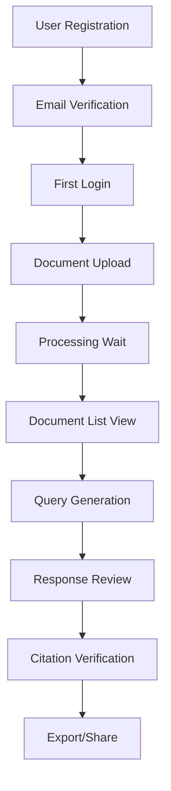

# TinyRAG Version 1.3.1 - Comprehensive Testing & Integration Plan

## 🎯 Mission: Complete Testing Coverage & UI Integration

**Target Completion:** February 2025  
**Status:** 📋 PLANNING PHASE  
**Objective:** Ensure all API endpoints, UI components, and core features work seamlessly together

---

## 🚀 Phase Overview: From Foundation to Full Feature Testing

### Version Progression Strategy
- **v1.3.0** ✅: Infrastructure & Authentication (COMPLETED)
- **v1.3.1** 🔄: Complete Testing & UI Integration (CURRENT)
- **v1.3.2** 📅: LLM Features & Advanced RAG (NEXT)

---

## 📋 Testing Objectives

### Primary Goals
1. **🧪 API Endpoint Testing**: Test every endpoint with various scenarios
2. **🎨 UI Component Testing**: Verify all frontend components work correctly
3. **🔗 Integration Testing**: Ensure seamless API-UI communication
4. **⚡ Performance Testing**: Validate response times and reliability
5. **🛡️ Security Testing**: Verify authentication and authorization
6. **📚 Documentation Testing**: Ensure all docs are accurate and up-to-date

---

## 🎯 Detailed Testing Plan

### 1. API Endpoint Comprehensive Testing

#### Authentication Endpoints
```http
🧪 POST /auth/register
  ├── ✅ Valid registration with strong password
  ├── 🔄 Invalid email format
  ├── 🔄 Weak password rejection
  ├── 🔄 Duplicate email/username handling
  └── 🔄 Rate limiting validation

🧪 POST /auth/login
  ├── ✅ Valid credentials
  ├── 🔄 Invalid email/password
  ├── 🔄 Non-existent user
  ├── 🔄 Rate limiting validation
  └── 🔄 Remember me functionality

🧪 GET /auth/me
  ├── ✅ Valid JWT token
  ├── 🔄 Invalid/expired token
  ├── 🔄 Missing token
  └── 🔄 Malformed token

🧪 PUT /auth/me
  ├── 🔄 Profile update with valid data
  ├── 🔄 Invalid data validation
  └── 🔄 Unauthorized access
```

#### Document Management Endpoints
```http
🧪 POST /documents/upload
  ├── 🔄 Valid PDF upload
  ├── 🔄 Invalid file format
  ├── 🔄 File size limits
  ├── 🔄 Missing authentication
  └── 🔄 Metadata extraction

🧪 GET /documents
  ├── ✅ Empty list (working)
  ├── 🔄 Populated list with documents
  ├── 🔄 Pagination parameters
  ├── 🔄 Sorting options
  └── 🔄 User-specific filtering

🧪 GET /documents/{document_id}
  ├── 🔄 Valid document retrieval
  ├── 🔄 Non-existent document
  ├── 🔄 Unauthorized access
  └── 🔄 Metadata display

🧪 DELETE /documents/{document_id}
  ├── 🔄 Successful deletion
  ├── 🔄 Non-existent document
  └── 🔄 Unauthorized deletion
```

#### RAG Generation Endpoints
```http
🧪 POST /generate
  ├── 🔄 Simple query generation
  ├── 🔄 Complex multi-document query
  ├── 🔄 Empty document set
  ├── 🔄 Rate limiting validation
  └── 🔄 Response quality validation

🧪 GET /generations/{generation_id}
  ├── 🔄 Valid generation retrieval
  ├── 🔄 Non-existent generation
  └── 🔄 Unauthorized access
```

#### Admin Endpoints
```http
🧪 GET /admin/users
  ├── 🔄 Admin access granted
  ├── 🔄 Non-admin access denied
  └── 🔄 User list pagination

🧪 GET /admin/system-stats
  ├── 🔄 System metrics display
  └── 🔄 Admin-only access
```

### 2. UI Component Testing

#### Authentication Components
```typescript
🎨 LoginForm Component
  ├── 🔄 Form validation
  ├── 🔄 Successful login flow
  ├── 🔄 Error message display
  └── 🔄 Remember me checkbox

🎨 RegisterForm Component
  ├── 🔄 Form validation
  ├── 🔄 Password strength indicator
  ├── 🔄 Successful registration flow
  └── 🔄 Error handling

🎨 UserProfile Component
  ├── 🔄 Profile display
  ├── 🔄 Edit functionality
  └── 🔄 Logout functionality
```

#### Document Management Components
```typescript
🎨 DocumentUpload Component
  ├── 🔄 File drag & drop
  ├── 🔄 Upload progress indicator
  ├── 🔄 File validation
  └── 🔄 Success/error feedback

🎨 DocumentList Component
  ├── 🔄 Document display
  ├── 🔄 Pagination controls
  ├── 🔄 Search functionality
  └── 🔄 Delete confirmation

🎨 DocumentViewer Component
  ├── 🔄 Document content display
  ├── 🔄 Metadata panel
  └── 🔄 Citation highlighting
```

#### RAG Interface Components
```typescript
🎨 QueryInterface Component
  ├── 🔄 Query input validation
  ├── 🔄 Document selection
  ├── 🔄 Generate button functionality
  └── 🔄 Loading states

🎨 ResponseViewer Component
  ├── 🔄 Generated content display
  ├── 🔄 Citation links
  ├── 🔄 Quality indicators
  └── 🔄 Export functionality
```

### 3. Integration Testing Scenarios

#### End-to-End User Workflows


#### Cross-Component Integration
```typescript
🔗 Authentication Flow Integration
  ├── 🔄 Login → Dashboard redirect
  ├── 🔄 Token refresh handling
  ├── 🔄 Logout → Login redirect
  └── 🔄 Protected route access

🔗 Document Management Flow
  ├── 🔄 Upload → Processing → List
  ├── 🔄 View → Edit → Save
  └── 🔄 Delete → Confirmation → Refresh

🔗 RAG Generation Flow
  ├── 🔄 Query → Processing → Response
  ├── 🔄 Citation → Source → Verification
  └── 🔄 Feedback → Quality → Improvement
```

### 4. Performance Testing

#### Response Time Targets
```yaml
API Performance Targets:
  - Authentication: < 200ms
  - Document Upload: < 5s per MB
  - Document List: < 100ms
  - Query Generation: < 10s
  - Health Check: < 50ms

UI Performance Targets:
  - Initial Load: < 2s
  - Route Changes: < 500ms
  - Component Rendering: < 100ms
  - File Upload UI: < 1s response
```

#### Load Testing Scenarios
```yaml
Concurrent Users:
  - 10 users: Basic functionality
  - 50 users: Normal load
  - 100 users: Peak load
  - 500 users: Stress test

Test Scenarios:
  - Simultaneous logins
  - Concurrent file uploads
  - Parallel query generation
  - Mixed workload testing
```

---

## 🛠️ Testing Infrastructure

### Test Automation Setup
```python
# Backend Testing Stack
- pytest: Unit and integration tests
- httpx: API client testing
- factory_boy: Test data generation
- pytest-asyncio: Async test support
- coverage.py: Code coverage tracking

# Frontend Testing Stack
- Jest: Unit testing framework
- React Testing Library: Component testing
- Cypress: End-to-end testing
- MSW: API mocking
- Storybook: Component documentation
```

### Test Environment Configuration
```yaml
Testing Environments:
  - Unit: Isolated component testing
  - Integration: Service-to-service testing
  - Staging: Production-like environment
  - Performance: Load testing environment
```

---

## 📊 Success Criteria

### Coverage Targets
- **API Endpoint Coverage**: 100% of endpoints tested
- **UI Component Coverage**: 95% of components tested
- **Integration Test Coverage**: 90% of user workflows
- **Code Coverage**: 85% minimum for critical paths

### Quality Gates
- **Response Time**: All targets met
- **Error Rate**: < 1% for normal operations
- **Security**: Zero authentication vulnerabilities
- **Documentation**: 100% accuracy verification

### User Experience Metrics
- **Task Completion Rate**: > 95%
- **Error Recovery**: < 30s average
- **User Satisfaction**: > 4.5/5 rating
- **Performance Perception**: "Fast" rating

---

## 🚀 Implementation Timeline

### Week 1: API Testing Foundation
- Set up comprehensive test suite
- Test all authentication endpoints
- Validate document management APIs
- Basic performance benchmarking

### Week 2: UI Component Testing
- Create component test suite
- Test authentication UI flows
- Validate document management UI
- Cross-browser compatibility testing

### Week 3: Integration Testing
- End-to-end workflow testing
- API-UI integration validation
- Performance testing under load
- Security penetration testing

### Week 4: Documentation & Optimization
- Update all documentation
- Performance optimization
- Bug fixes and improvements
- Release preparation

---

## 🔧 Test Implementation Strategy

### Automated Testing Pipeline
```yaml
CI/CD Integration:
  - Pre-commit: Linting and basic tests
  - Pull Request: Full test suite
  - Staging Deploy: Integration tests
  - Production Deploy: Smoke tests
```

### Manual Testing Checklist
```markdown
□ User registration flow
□ Document upload process
□ Query generation workflow
□ Citation verification
□ Admin functionality
□ Error handling scenarios
□ Mobile responsiveness
□ Accessibility compliance
```

---

## 📝 Documentation Updates Required

### Technical Documentation
- API endpoint documentation refresh
- Component library documentation
- Integration testing guide
- Performance benchmarking results

### User Documentation
- Complete user guide
- Tutorial videos
- FAQ updates
- Troubleshooting guide

---

## 🎯 Ready for v1.3.2 Criteria

### v1.3.1 Exit Criteria
- ✅ All API endpoints tested and working
- ✅ All UI components validated
- ✅ Integration workflows functioning
- ✅ Performance targets met
- ✅ Documentation updated and accurate
- ✅ Zero critical security vulnerabilities

### Next Phase Preparation
- LLM integration testing framework
- Advanced RAG testing scenarios
- Metadata extraction validation
- Enhanced reranking verification

---

**Status**: 📋 Ready to begin comprehensive testing phase
**Duration**: 4 weeks estimated
**Priority**: High - Foundation for all future features 