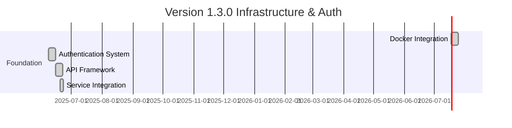
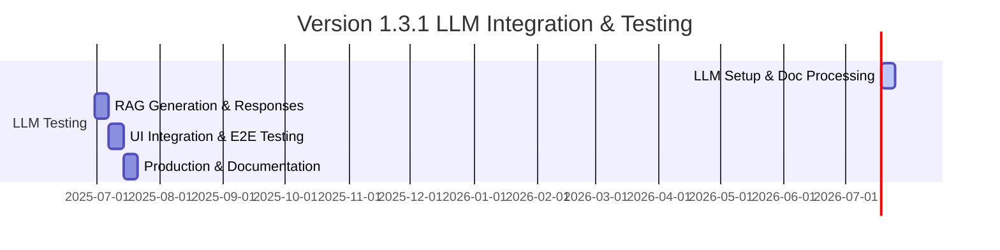
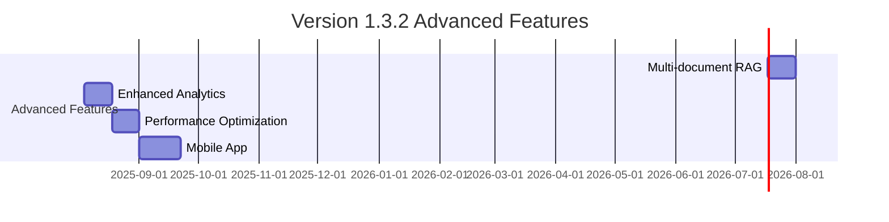

# Feature Map

This document visualizes the relationships and dependencies between different features in the TinyRAG system.

## Core Features

## Feature Dependencies

### 1. Document Processing
- **Dependencies:**
  - User Authentication
  - File Storage
  - PDF Parser
- **Dependent Features:**
  - RAG Engine
  - Document Management
  - Search System

### 2. RAG Engine
- **Dependencies:**
  - Document Processing
  - Vector Database
  - LLM Integration
- **Dependent Features:**
  - Memo Generation
  - Search System
  - Question Answering

### 3. Memo Generation
- **Dependencies:**
  - RAG Engine
  - Prompt Management
  - Citation System
- **Dependent Features:**
  - Evaluation System
  - Export System
  - Version Control

### 4. Citation System
- **Dependencies:**
  - Document Processing
  - RAG Engine
- **Dependent Features:**
  - Memo Generation
  - Source Verification
  - Export System

## Feature Timeline

### Version 1.3.0 (Completed ✅)

### Version 1.3.1 (Current 🔄 - Real LLM Focus)

### Version 1.3.2 (Planned 📅)

## Feature Relationships

### 1. User Interface Features

### 2. Backend Services

### 3. Data Flow

## Feature Status

### Implemented (v1.3.0 ✅)
- ✅ **Docker Infrastructure**: Full containerized deployment
- ✅ **Authentication System**: JWT-based auth with user management
- ✅ **API Framework**: FastAPI with OpenAPI documentation
- ✅ **Service Integration**: MongoDB, Redis, Qdrant connections
- ✅ **Health Monitoring**: Comprehensive service health checks
- ✅ **Core Models**: Document, Generation, and User models

### In Progress (v1.3.1 🔄)
- 🔄 **API Testing Suite**: Comprehensive endpoint testing
- 🔄 **UI Component Tests**: React component validation
- 🔄 **Integration Testing**: End-to-end workflow testing
- 🔄 **Performance Benchmarks**: Response time and load testing
- 🔄 **Documentation Updates**: Complete user and developer guides

### Planned (v1.3.2+ 📅)
- 📅 **LLM Integration**: OpenAI GPT integration for RAG
- 📅 **Metadata Extraction**: Intelligent document metadata
- 📅 **Enhanced Reranking**: Multi-factor relevance scoring
- 📅 **Vector Search**: Semantic search with embeddings
- 📅 **Advanced RAG**: Multi-document analysis and citations

## Feature Metrics

### Performance Metrics
- Document Processing: < 30s
- Memo Generation: < 60s
- API Response: < 200ms

### Quality Metrics
- Citation Accuracy: > 95%
- Memo Quality: > 90%
- User Satisfaction: > 4.5/5

## Feature Dependencies Matrix

| Feature | Depends On | Required By |
|---------|------------|-------------|
| Document Processing | User Auth, Storage | RAG Engine |
| RAG Engine | Document Processing, Vector DB | Memo Generation |
| Memo Generation | RAG Engine, Prompts | Citations |
| Citation System | Document Processing | Export |
| User Auth | None | All Features |
| Storage | None | Document Processing |
| Vector DB | None | RAG Engine |
| Prompts | None | Memo Generation |

## Feature Roadmap

### Q2 2024
1. Enhanced Document Processing
2. Advanced RAG Techniques
3. Improved Citations

### Q3 2024
1. Multi-document Support
2. Custom Templates
3. Analytics Dashboard

### Q4 2024
1. Advanced Analytics
2. API Improvements
3. Performance Optimization 