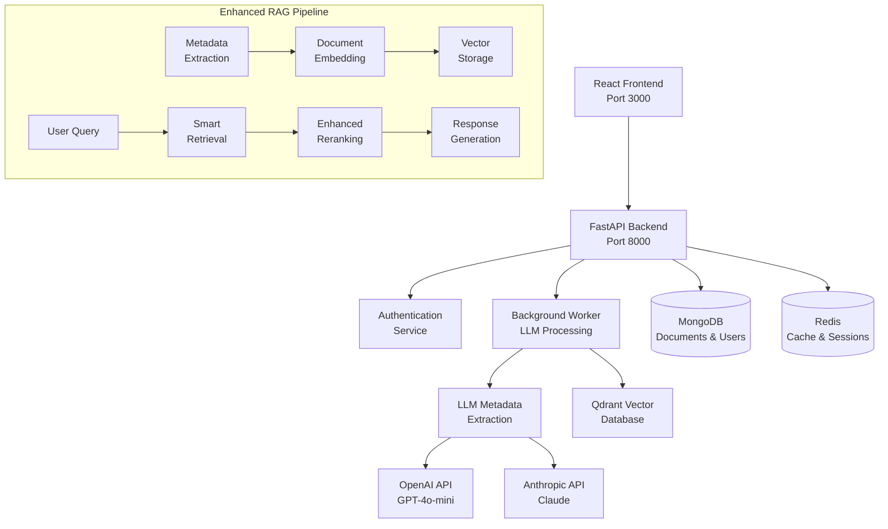

# TinyRAG v1.3 🚀

**Advanced Retrieval-Augmented Generation System with LLM-Powered Metadata Extraction**

TinyRAG v1.3 is a production-ready RAG system featuring JWT-based authentication, intelligent metadata extraction using Large Language Models, and enhanced reranking capabilities for superior document retrieval and generation.

## ✨ What's New in v1.3

### 🔐 **Authentication & Authorization**
- JWT-based authentication with role-based access control (RBAC)
- API key management with usage tracking
- Rate limiting and security middleware
- Admin dashboard for user management

### 🧠 **LLM-Powered Metadata Extraction**
- Intelligent metadata extraction using GPT-4o-mini/Claude
- Automatic keyword, entity, and topic identification
- Date extraction and temporal relevance scoring
- Content quality assessment and readability analysis

### 🎯 **Enhanced Reranking**
- Metadata-aware intelligent reranking
- Multi-factor scoring (semantic, keyword, entity, temporal, quality)
- Diversity filtering for optimal result sets
- Detailed score explanations and transparency

### 🐳 **Production-Ready Docker Setup**
- Complete containerized architecture
- Health checks and dependency management
- Comprehensive logging and monitoring
- One-command deployment

## 🏗️ Architecture



## 🚀 Quick Start

### Prerequisites

- Docker & Docker Compose
- OpenAI API key (required for LLM features)
- 8GB+ RAM recommended

### 1. Clone and Setup

```bash
git clone https://github.com/yourusername/tiny-RAG.git
cd tiny-RAG

# Copy environment template
cp env.example .env

# Edit .env with your configuration
# REQUIRED: Set OPENAI_API_KEY and JWT_SECRET_KEY
nano .env
```

### 2. One-Command Startup

```bash
# Start all services
./scripts/start-tinyrag.sh

# Or with options
./scripts/start-tinyrag.sh --rebuild  # Rebuild images
./scripts/start-tinyrag.sh --logs     # Show logs after start
```

### 3. Access the Application

- **Frontend UI**: http://localhost:3000
- **API Documentation**: http://localhost:8000/docs
- **API Health**: http://localhost:8000/health

### 4. Default Admin Login

```
Email: admin@tinyrag.local
Username: admin
Password: TinyRAG2024!
```

⚠️ **Change the default password immediately!**

## 📋 Core Features

### 🔐 Authentication System

- **User Registration & Login**: Secure JWT-based authentication
- **Role-Based Access**: Admin, User, and Viewer roles
- **API Key Management**: Generate and manage API keys for programmatic access
- **Rate Limiting**: Configurable rate limits for security
- **Session Management**: Secure session handling with Redis

### 🧠 Intelligent Metadata Extraction

- **LLM-Powered Analysis**: Uses GPT-4o-mini for comprehensive metadata extraction
- **Multi-Type Extraction**: Keywords, entities, dates, topics, sentiment, summaries
- **Quality Assessment**: Content readability and information density scoring
- **Confidence Scoring**: All extractions include confidence levels
- **Caching**: Intelligent caching to reduce LLM API costs

### 🎯 Advanced Retrieval & Reranking

- **Semantic Search**: Vector-based similarity matching
- **Metadata Filtering**: Filter by dates, entities, topics, quality scores
- **Intelligent Reranking**: Multi-factor scoring algorithm
- **Diversity Filtering**: Ensures diverse, non-redundant results
- **Explanation System**: Detailed scoring explanations for transparency

### 📄 Document Processing

- **Multi-Format Support**: PDF, DOCX, TXT, MD files
- **Intelligent Chunking**: Context-aware document segmentation
- **Metadata Preservation**: Maintains document structure and metadata
- **Batch Processing**: Efficient handling of multiple documents
- **Progress Tracking**: Real-time processing status updates

## 🛠️ Development Setup

### Local Development

```bash
# Install dependencies
pip install -r rag-memo-api/requirements.txt
pip install -r rag-memo-core-lib/requirements.txt

# Start infrastructure only
docker-compose up -d tinyrag-mongodb tinyrag-redis tinyrag-qdrant

# Run API locally
cd rag-memo-api
uvicorn main:app --reload --port 8000

# Run UI locally
cd rag-memo-ui
npm install
npm run dev
```

### Testing

```bash
# Run API tests
cd rag-memo-api
pytest tests/ -v

# Run UI tests
cd rag-memo-ui
npm test

# Run integration tests
./scripts/run-tests.sh
```

## 📚 API Usage Examples

### Authentication

```bash
# Register a new user
curl -X POST "http://localhost:8000/auth/register" \
  -H "Content-Type: application/json" \
  -d '{
    "email": "user@example.com",
    "username": "newuser",
    "password": "SecurePass123!",
    "full_name": "John Doe"
  }'

# Login
curl -X POST "http://localhost:8000/auth/login" \
  -H "Content-Type: application/json" \
  -d '{
    "identifier": "user@example.com",
    "password": "SecurePass123!"
  }'
```

### Document Upload with Metadata Extraction

```bash
# Upload document with LLM metadata extraction
curl -X POST "http://localhost:8000/documents/upload" \
  -H "Authorization: Bearer YOUR_JWT_TOKEN" \
  -F "file=@document.pdf"
```

### Enhanced RAG Query

```bash
# Generate response with enhanced reranking
curl -X POST "http://localhost:8000/generate" \
  -H "Authorization: Bearer YOUR_JWT_TOKEN" \
  -H "Content-Type: application/json" \
  -d '{
    "query": "What are the main findings about climate change?",
    "document_ids": ["doc1", "doc2"],
    "max_tokens": 1000
  }'
```

### API Key Usage

```bash
# Create API key
curl -X POST "http://localhost:8000/auth/api-keys" \
  -H "Authorization: Bearer YOUR_JWT_TOKEN" \
  -H "Content-Type: application/json" \
  -d '{
    "name": "My App Key",
    "permissions": ["read", "write"],
    "expires_in_days": 90
  }'

# Use API key
curl -X GET "http://localhost:8000/documents" \
  -H "X-API-Key: sk-your-api-key-here"
```

## ⚙️ Configuration

### Environment Variables

Key configuration options in `.env`:

```bash
# Authentication
JWT_SECRET_KEY=your-super-secret-key
JWT_ACCESS_TOKEN_EXPIRE_MINUTES=30

# LLM Configuration
OPENAI_API_KEY=sk-your-openai-key
LLM_MODEL=gpt-4o-mini

# Features
ENABLE_METADATA_EXTRACTION=true
ENABLE_ENHANCED_RERANKING=true

# Performance
WORKER_CONCURRENCY=4
RATE_LIMIT_ENABLED=true
```

### Advanced Configuration

See `Docs/Auth/AuthorizationGuide.md` for comprehensive authentication setup and `Docs/Todo/VersionPlanDoc.md` for detailed architecture information.

## 🔧 Troubleshooting

### Common Issues

1. **Services won't start**
   ```bash
   # Check Docker status
   docker info
   
   # Check service logs
   docker-compose logs tinyrag-api
   ```

2. **Authentication errors**
   ```bash
   # Verify JWT secret is set
   echo $JWT_SECRET_KEY
   
   # Check API health
   curl http://localhost:8000/health
   ```

3. **LLM extraction fails**
   ```bash
   # Verify OpenAI API key
   echo $OPENAI_API_KEY
   
   # Check worker logs
   docker-compose logs tinyrag-worker
   ```

### Reset Everything

```bash
# Stop all services and remove data
docker-compose down -v

# Rebuild and restart
./scripts/start-tinyrag.sh --rebuild
```

## 📊 Monitoring & Logging

### Service Monitoring

```bash
# Check all service status
docker-compose ps

# View real-time logs
docker-compose logs -f

# Monitor specific service
docker-compose logs -f tinyrag-api
```

### Health Checks

- **API Health**: `GET /health`
- **Database Status**: Included in health endpoint
- **LLM Service Status**: Monitored automatically
- **Authentication Status**: JWT validation checks

## 🤝 Contributing

1. Fork the repository
2. Create a feature branch (`git checkout -b feature/amazing-feature`)
3. Follow the coding standards in `.cursorrules`
4. Add comprehensive tests
5. Commit with semantic messages (`git commit -m 'feat: add amazing feature'`)
6. Push to the branch (`git push origin feature/amazing-feature`)
7. Open a Pull Request

### Development Standards

- **Type Annotations**: All Python code must be fully typed
- **Documentation**: Google-style docstrings required
- **Testing**: 90%+ test coverage target
- **Security**: Follow OWASP guidelines
- **Performance**: Profile and optimize critical paths

## 📄 License

This project is licensed under the MIT License - see the [LICENSE](LICENSE) file for details.

## 🙏 Acknowledgments

- OpenAI for GPT-4o-mini API
- Anthropic for Claude API
- FastAPI for the excellent web framework
- Qdrant for vector database capabilities
- The open-source community for inspiration and tools

## 📞 Support

- **Documentation**: `/docs` when running locally
- **Issues**: GitHub Issues
- **Discussions**: GitHub Discussions
- **Security**: security@tinyrag.local

---

**TinyRAG v1.3** - Making advanced RAG accessible to everyone! 🚀