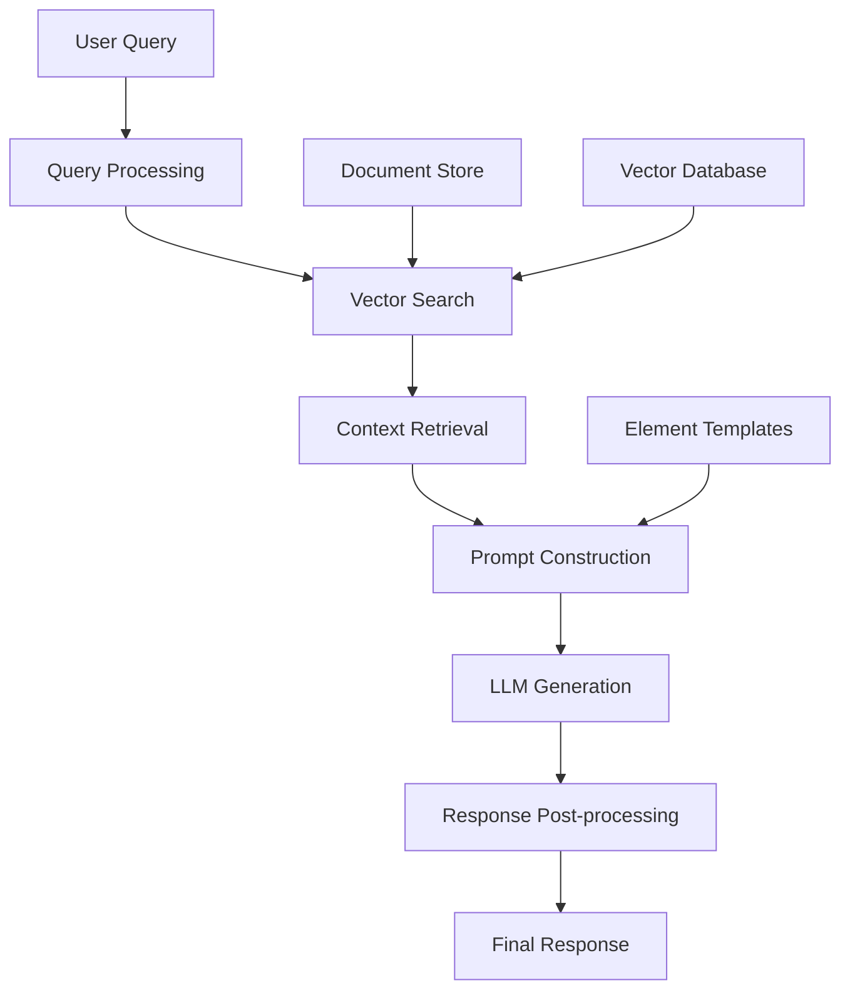

# RAG Pipeline Architecture

**TinyRAG Knowledge Base** | Last Updated: June 25, 2025

---

## Overview

TinyRAG's Retrieval-Augmented Generation (RAG) pipeline combines the power of vector search with large language models to provide accurate, contextual responses grounded in your documents. This guide explores the complete RAG workflow from query processing to response generation.

## 🔄 RAG Pipeline Flow



## 📝 Query Processing

### Query Enhancement

```python
def process_user_query(query: str, context: Optional[Dict] = None) -> ProcessedQuery:
    """Process and enhance user query for optimal retrieval."""
    
    # Clean and normalize query
    cleaned_query = clean_query_text(query)
    
    # Extract query intent
    intent = classify_query_intent(cleaned_query)
    
    # Generate query embeddings
    query_embedding = embedding_model.embed(cleaned_query)
    
    # Expand query with synonyms and related terms
    expanded_terms = expand_query_terms(cleaned_query)
    
    # Create search filters based on context
    filters = create_search_filters(context, intent)
    
    return ProcessedQuery(
        original=query,
        cleaned=cleaned_query,
        embedding=query_embedding,
        intent=intent,
        expanded_terms=expanded_terms,
        filters=filters
    )
```

### Query Intent Classification

```python
def classify_query_intent(query: str) -> QueryIntent:
    """Classify query intent for optimized retrieval strategy."""
    
    intent_patterns = {
        "factual": [r"what is", r"define", r"explain"],
        "procedural": [r"how to", r"steps", r"process"],
        "comparative": [r"compare", r"difference", r"versus"],
        "analytical": [r"analyze", r"evaluate", r"assess"],
        "creative": [r"generate", r"create", r"write"]
    }
    
    query_lower = query.lower()
    
    for intent, patterns in intent_patterns.items():
        if any(re.search(pattern, query_lower) for pattern in patterns):
            return QueryIntent(intent)
    
    return QueryIntent("general")
```

## 🔍 Vector Search & Retrieval

### Multi-Stage Retrieval

```python
async def retrieve_relevant_chunks(
    query: ProcessedQuery,
    collection_name: str,
    top_k: int = 20,
    rerank_top_k: int = 5
) -> List[RetrievedChunk]:
    """Multi-stage retrieval with reranking."""
    
    # Stage 1: Vector similarity search
    vector_results = await vector_search(
        query.embedding,
        collection_name,
        top_k=top_k,
        filters=query.filters
    )
    
    # Stage 2: Keyword-based filtering
    keyword_filtered = filter_by_keywords(
        vector_results,
        query.expanded_terms
    )
    
    # Stage 3: Reranking with cross-encoder
    reranked_results = rerank_results(
        keyword_filtered,
        query.cleaned,
        top_k=rerank_top_k
    )
    
    # Stage 4: Diversity filtering
    diverse_results = ensure_diversity(reranked_results)
    
    return diverse_results
```

### Advanced Search Strategies

#### Hybrid Search
```python
def hybrid_search(
    vector_results: List[VectorResult],
    keyword_results: List[KeywordResult],
    alpha: float = 0.7
) -> List[SearchResult]:
    """Combine vector and keyword search results."""
    
    combined_results = {}
    
    # Normalize vector scores
    max_vector_score = max(r.score for r in vector_results)
    for result in vector_results:
        doc_id = result.chunk_id
        normalized_score = result.score / max_vector_score
        combined_results[doc_id] = alpha * normalized_score
    
    # Normalize keyword scores
    max_keyword_score = max(r.score for r in keyword_results)
    for result in keyword_results:
        doc_id = result.chunk_id
        normalized_score = result.score / max_keyword_score
        if doc_id in combined_results:
            combined_results[doc_id] += (1 - alpha) * normalized_score
        else:
            combined_results[doc_id] = (1 - alpha) * normalized_score
    
    # Sort by combined score
    sorted_results = sorted(
        combined_results.items(),
        key=lambda x: x[1],
        reverse=True
    )
    
    return [SearchResult(chunk_id=doc_id, score=score) for doc_id, score in sorted_results]
```

#### Contextual Retrieval
```python
def contextual_retrieval(
    query: ProcessedQuery,
    conversation_history: List[Message],
    project_context: ProjectContext
) -> List[RetrievedChunk]:
    """Retrieve chunks considering conversation context."""
    
    # Build contextual query
    context_query = build_contextual_query(
        query.cleaned,
        conversation_history,
        project_context
    )
    
    # Weight recent context higher
    context_weights = calculate_context_weights(conversation_history)
    
    # Search with context
    results = search_with_context(
        context_query,
        context_weights,
        project_context.document_filters
    )
    
    return results
```

## 🧠 Context Assembly

### Intelligent Context Selection

```python
def assemble_context(
    retrieved_chunks: List[RetrievedChunk],
    query: ProcessedQuery,
    max_context_length: int = 4000
) -> AssembledContext:
    """Intelligently assemble context from retrieved chunks."""
    
    # Group chunks by document/section
    grouped_chunks = group_chunks_by_source(retrieved_chunks)
    
    # Select best chunks considering:
    # 1. Relevance score
    # 2. Information density
    # 3. Complementary information
    # 4. Context length constraints
    
    selected_chunks = []
    current_length = 0
    
    # Prioritize high-relevance chunks
    for chunk in sorted(retrieved_chunks, key=lambda x: x.score, reverse=True):
        chunk_length = len(chunk.text.split())
        
        if current_length + chunk_length <= max_context_length:
            if not is_redundant(chunk, selected_chunks):
                selected_chunks.append(chunk)
                current_length += chunk_length
        
        if current_length >= max_context_length * 0.9:
            break
    
    # Create coherent context
    context = create_coherent_context(selected_chunks, query.intent)
    
    return AssembledContext(
        chunks=selected_chunks,
        formatted_context=context,
        total_length=current_length,
        sources=extract_sources(selected_chunks)
    )
```

### Context Optimization

```python
def optimize_context_for_llm(
    context: AssembledContext,
    query: ProcessedQuery,
    element_config: ElementConfig
) -> OptimizedContext:
    """Optimize context based on LLM requirements and element configuration."""
    
    optimizations = []
    
    # Summarize long chunks if needed
    if context.total_length > element_config.max_context_length:
        context = summarize_long_chunks(context, element_config.max_context_length)
        optimizations.append("chunk_summarization")
    
    # Add structure for complex queries
    if query.intent in ["analytical", "comparative"]:
        context = add_structural_markers(context)
        optimizations.append("structural_enhancement")
    
    # Highlight key information
    if element_config.highlight_entities:
        context = highlight_entities(context, query.expanded_terms)
        optimizations.append("entity_highlighting")
    
    return OptimizedContext(
        context=context,
        optimizations=optimizations,
        confidence_score=calculate_context_confidence(context, query)
    )
```

## 🎯 Prompt Construction

### Dynamic Prompt Assembly

```python
def construct_rag_prompt(
    query: ProcessedQuery,
    context: OptimizedContext,
    element: Element,
    system_instructions: Optional[str] = None
) -> ConstructedPrompt:
    """Construct optimized prompt for RAG generation."""
    
    # Base prompt template
    template = element.template_content
    
    # System instructions
    system_prompt = system_instructions or build_default_system_prompt(query.intent)
    
    # Context section
    context_section = format_context_section(context)
    
    # Query section
    query_section = format_query_section(query)
    
    # Instructions section
    instructions = build_task_instructions(query.intent, element.execution_config)
    
    # Variable substitution
    variables = {
        "context": context_section,
        "query": query_section,
        "instructions": instructions,
        **element.get_custom_variables()
    }
    
    # Construct final prompt
    final_prompt = template.format(**variables)
    
    # Validate prompt length
    prompt_tokens = count_tokens(final_prompt)
    if prompt_tokens > element.execution_config.get("max_prompt_tokens", 8000):
        final_prompt = truncate_prompt_intelligently(final_prompt, element.execution_config)
    
    return ConstructedPrompt(
        system_prompt=system_prompt,
        user_prompt=final_prompt,
        variables=variables,
        token_count=prompt_tokens,
        context_sources=context.sources
    )
```

### Prompt Template Examples

#### Factual Query Template
```python
FACTUAL_TEMPLATE = """
Based on the provided context, answer the following question accurately and concisely.

Context:
{context}

Question: {query}

Instructions:
- Provide a direct, factual answer
- Cite specific sources when possible
- If information is not in the context, clearly state so
- Use bullet points for multiple facts

Answer:
"""
```

#### Analytical Query Template
```python
ANALYTICAL_TEMPLATE = """
Analyze the provided information to answer the following question comprehensively.

Context:
{context}

Question: {query}

Instructions:
- Break down your analysis into clear sections
- Consider multiple perspectives
- Support conclusions with evidence from the context
- Identify any limitations in the available information

Analysis:
"""
```

## 🤖 LLM Generation

### Generation Strategy Selection

```python
def select_generation_strategy(
    query: ProcessedQuery,
    element: Element,
    context: OptimizedContext
) -> GenerationConfig:
    """Select optimal generation strategy based on query and context."""
    
    base_config = element.execution_config.copy()
    
    # Adjust based on query intent
    if query.intent == "factual":
        base_config.update({
            "temperature": 0.1,
            "top_p": 0.9,
            "max_tokens": 500
        })
    elif query.intent == "creative":
        base_config.update({
            "temperature": 0.8,
            "top_p": 0.95,
            "max_tokens": 1500
        })
    elif query.intent == "analytical":
        base_config.update({
            "temperature": 0.3,
            "top_p": 0.9,
            "max_tokens": 2000
        })
    
    # Adjust based on context quality
    if context.confidence_score < 0.7:
        base_config["temperature"] = min(base_config["temperature"] + 0.1, 1.0)
    
    return GenerationConfig(**base_config)
```

### Streaming Generation

```python
async def generate_rag_response_stream(
    prompt: ConstructedPrompt,
    config: GenerationConfig,
    callback: Callable[[str], None]
) -> AsyncGenerator[GenerationChunk, None]:
    """Generate streaming RAG response."""
    
    model = get_llm_model(config.model_name)
    
    # Track generation metrics
    start_time = time.time()
    total_tokens = 0
    
    try:
        async for chunk in model.generate_stream(
            system=prompt.system_prompt,
            user=prompt.user_prompt,
            **config.model_parameters
        ):
            # Process chunk
            processed_chunk = process_generation_chunk(chunk)
            
            # Update metrics
            total_tokens += len(processed_chunk.text.split())
            
            # Call progress callback
            if callback:
                callback(processed_chunk.text)
            
            yield GenerationChunk(
                text=processed_chunk.text,
                tokens=total_tokens,
                finish_reason=processed_chunk.finish_reason,
                timestamp=time.time() - start_time
            )
            
    except Exception as e:
        yield GenerationChunk(
            text="",
            error=str(e),
            finish_reason="error",
            timestamp=time.time() - start_time
        )
```

## 🔍 Response Post-processing

### Citation and Source Attribution

```python
def add_citations(
    response: str,
    context_sources: List[ContextSource]
) -> CitedResponse:
    """Add citations and source attribution to response."""
    
    # Identify claims that need citations
    claims = extract_factual_claims(response)
    
    cited_response = response
    citations = []
    
    for claim in claims:
        # Find supporting sources
        supporting_sources = find_supporting_sources(claim, context_sources)
        
        if supporting_sources:
            # Add inline citation
            citation_id = len(citations) + 1
            cited_response = cited_response.replace(
                claim.text,
                f"{claim.text} [{citation_id}]"
            )
            
            citations.append(Citation(
                id=citation_id,
                claim=claim.text,
                sources=supporting_sources,
                confidence=calculate_citation_confidence(claim, supporting_sources)
            ))
    
    return CitedResponse(
        text=cited_response,
        citations=citations,
        source_documents=list(set(s.document_id for s in context_sources))
    )
```

### Quality Assessment

```python
def assess_response_quality(
    response: CitedResponse,
    query: ProcessedQuery,
    context: OptimizedContext
) -> QualityAssessment:
    """Assess the quality of generated response."""
    
    assessment = QualityAssessment()
    
    # Relevance to query
    assessment.relevance_score = calculate_relevance(response.text, query.cleaned)
    
    # Factual accuracy (based on context)
    assessment.accuracy_score = calculate_accuracy(response.text, context)
    
    # Completeness
    assessment.completeness_score = calculate_completeness(response.text, query.intent)
    
    # Citation quality
    assessment.citation_score = assess_citations(response.citations, context)
    
    # Overall coherence
    assessment.coherence_score = calculate_coherence(response.text)
    
    # Overall score
    assessment.overall_score = calculate_weighted_average([
        (assessment.relevance_score, 0.3),
        (assessment.accuracy_score, 0.3),
        (assessment.completeness_score, 0.2),
        (assessment.citation_score, 0.1),
        (assessment.coherence_score, 0.1)
    ])
    
    return assessment
```

## 📊 Performance Optimization

### Caching Strategies

```python
class RAGCache:
    """Multi-level caching for RAG pipeline."""
    
    def __init__(self):
        self.query_cache = {}  # Cache processed queries
        self.retrieval_cache = {}  # Cache retrieval results
        self.generation_cache = {}  # Cache generated responses
    
    def get_cached_response(self, query_hash: str) -> Optional[CachedResponse]:
        """Get cached response for query."""
        return self.generation_cache.get(query_hash)
    
    def cache_response(
        self,
        query_hash: str,
        response: CitedResponse,
        ttl: int = 3600
    ):
        """Cache response with TTL."""
        self.generation_cache[query_hash] = CachedResponse(
            response=response,
            timestamp=time.time(),
            ttl=ttl
        )
    
    def invalidate_cache(self, patterns: List[str]):
        """Invalidate cache entries matching patterns."""
        for cache in [self.query_cache, self.retrieval_cache, self.generation_cache]:
            keys_to_remove = []
            for key in cache.keys():
                if any(pattern in key for pattern in patterns):
                    keys_to_remove.append(key)
            
            for key in keys_to_remove:
                del cache[key]
```

### Parallel Processing

```python
async def parallel_rag_pipeline(
    queries: List[str],
    project_context: ProjectContext
) -> List[RAGResponse]:
    """Process multiple queries in parallel."""
    
    # Process queries in parallel
    processed_queries = await asyncio.gather(*[
        process_user_query(query, project_context)
        for query in queries
    ])
    
    # Retrieve contexts in parallel
    contexts = await asyncio.gather(*[
        retrieve_and_assemble_context(query, project_context)
        for query in processed_queries
    ])
    
    # Generate responses in parallel (with rate limiting)
    semaphore = asyncio.Semaphore(3)  # Limit concurrent LLM calls
    
    async def generate_with_limit(query, context):
        async with semaphore:
            return await generate_rag_response(query, context)
    
    responses = await asyncio.gather(*[
        generate_with_limit(query, context)
        for query, context in zip(processed_queries, contexts)
    ])
    
    return responses
```

## 🔧 Configuration and Tuning

### RAG Pipeline Configuration

```python
class RAGConfig:
    """Configuration for RAG pipeline."""
    
    # Retrieval settings
    retrieval_top_k: int = 20
    rerank_top_k: int = 5
    diversity_threshold: float = 0.7
    
    # Context settings
    max_context_length: int = 4000
    context_overlap_threshold: float = 0.8
    enable_context_summarization: bool = True
    
    # Generation settings
    default_temperature: float = 0.3
    max_response_tokens: int = 1500
    enable_streaming: bool = True
    
    # Quality settings
    min_relevance_score: float = 0.6
    enable_fact_checking: bool = True
    citation_confidence_threshold: float = 0.7
    
    # Performance settings
    enable_caching: bool = True
    cache_ttl: int = 3600
    max_concurrent_requests: int = 5
```

### A/B Testing Framework

```python
def rag_ab_test(
    query: str,
    config_a: RAGConfig,
    config_b: RAGConfig,
    test_id: str
) -> ABTestResult:
    """Run A/B test between two RAG configurations."""
    
    # Generate responses with both configs
    response_a = run_rag_pipeline(query, config_a)
    response_b = run_rag_pipeline(query, config_b)
    
    # Compare responses
    comparison = compare_rag_responses(response_a, response_b)
    
    # Log test results
    log_ab_test_result(
        test_id=test_id,
        query=query,
        config_a=config_a,
        config_b=config_b,
        response_a=response_a,
        response_b=response_b,
        comparison=comparison
    )
    
    return ABTestResult(
        winner="A" if comparison.score_a > comparison.score_b else "B",
        confidence=comparison.confidence,
        metrics=comparison.detailed_metrics
    )
```

---

## Next Steps

- **[Element Types Guide](element-types.html)**: Learn how elements customize the RAG pipeline
- **[Evaluation Framework](evaluation-framework.html)**: Understand RAG response quality assessment
- **[Metadata Extraction](metadata-extraction.html)**: Deep dive into document processing

**Need Help?** Check the [performance optimization guide](../troubleshooting/performance-tips.html) or [debugging workflows](../troubleshooting/debugging-guide.html).

---

*This guide covers TinyRAG v1.4.1 RAG pipeline capabilities. For the latest updates, visit our [documentation portal](https://knowledge.tinyrag.com).* 